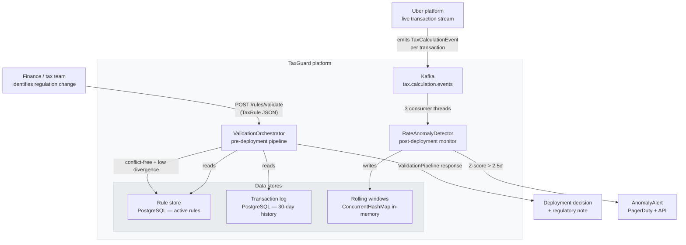
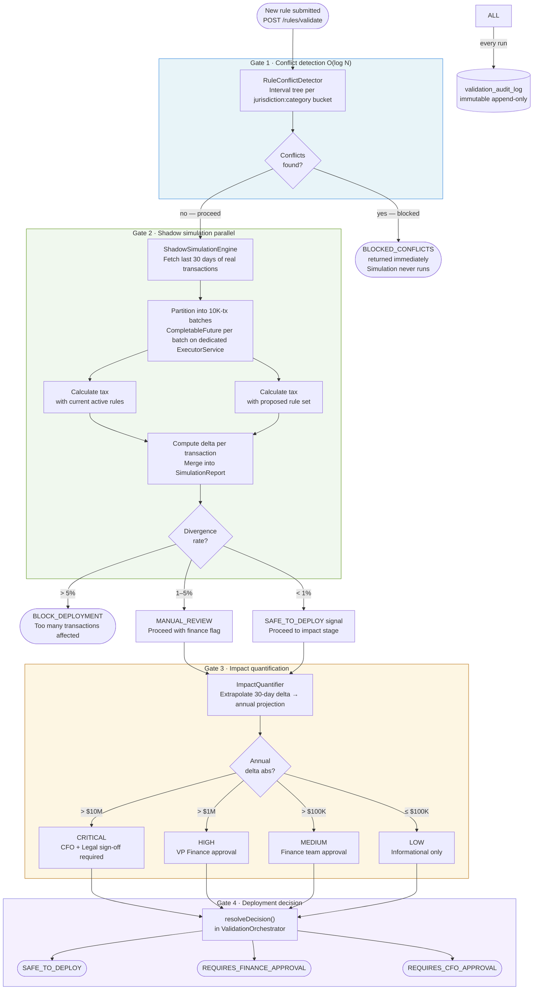
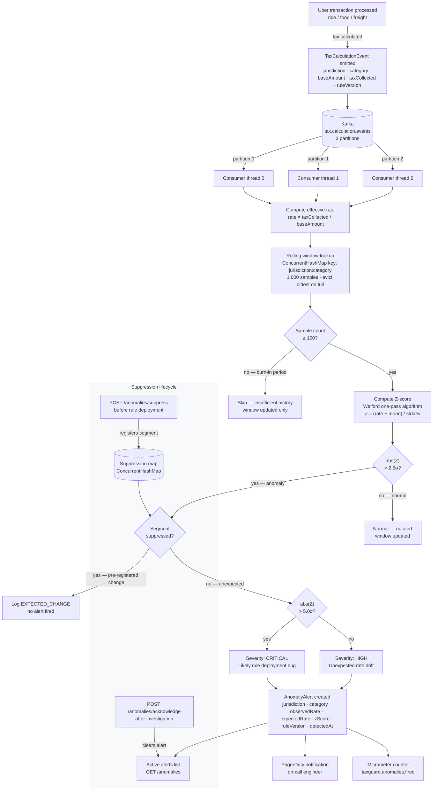
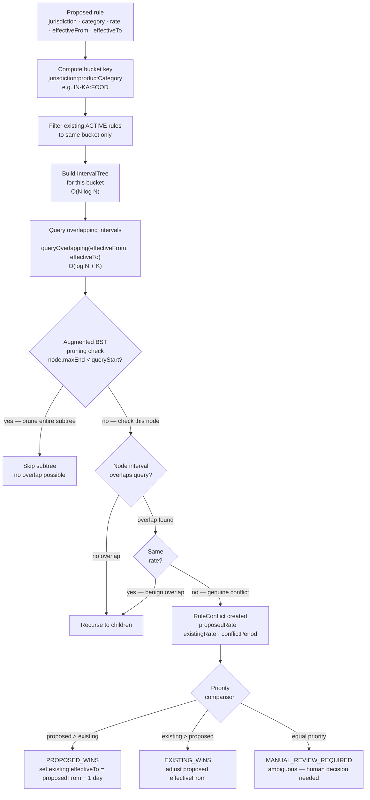
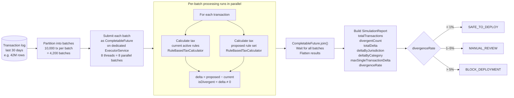
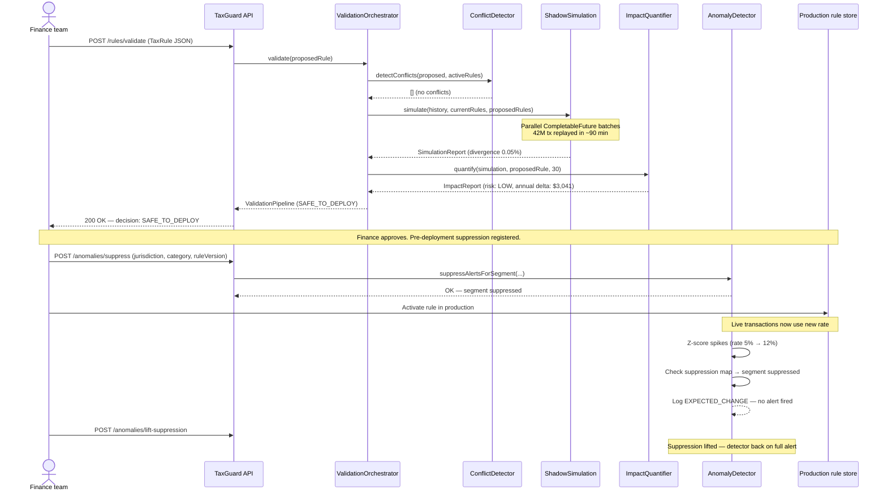

# TaxGuard — System Design Diagrams

> Tax Rule Safe Deployment Platform · Full workflow reference

---

## Diagram 1 · System architecture overview

Two entry points feed the platform: a proposed rule from the finance team (pre-deployment path) and a live Kafka stream of every Uber transaction (post-deployment path). Both paths converge on the same goal — ensuring no wrong tax rate is ever live in production.

---

## Diagram 2 · Validation pipeline (pre-deployment)

Every proposed rule passes through three sequential gates. Each gate is ordered cheapest-to-most-expensive — conflict detection runs in milliseconds and blocks the pipeline before any slow work begins.

---

## Diagram 3 · Live transaction monitoring (post-deployment)

Once a rule is live, the anomaly detector watches every transaction on the Kafka stream. It maintains isolated rolling windows per segment and fires statistical alerts when the effective rate deviates unexpectedly.

---

## Diagram 4 · Conflict detection deep dive (interval tree)

Two rules conflict when they share the same `jurisdiction:productCategory` bucket, have overlapping `effectiveFrom..effectiveTo` date intervals, and produce different rates. The interval tree's augmented `maxEnd` field enables O(log N) pruning.

---

## Diagram 5 · Shadow simulation internals

The simulation engine partitions historical transactions into 10K-item batches and processes each batch as an independent `CompletableFuture` on a dedicated `ExecutorService` — isolated from the JVM's `commonPool` to avoid starving HTTP threads.

---

## Diagram 6 · Rule deployment lifecycle (end to end)

The complete journey from a government announcing a tax change to a rule safely running in production, with the suppression handshake closing the loop back to monitoring.

---

## Component summary

| Component | Role | Key algorithm |
|---|---|---|
| `ValidationOrchestrator` | Pipeline coordinator — stages run cheapest-first, short-circuit on block | State machine |
| `RuleConflictDetector` | Finds overlapping rules before simulation runs | Interval tree O(log N + K) |
| `ShadowSimulationEngine` | Replays history through old vs new rules in parallel | `CompletableFuture` batching |
| `ImpactQuantifier` | Translates delta into annual $ projection and risk tier | Linear extrapolation + threshold |
| `RateAnomalyDetector` | Monitors live Kafka stream for unexpected rate changes | Welford Z-score, rolling window |
| `IntervalTree` | Core data structure for O(N log N) conflict scan | Augmented BST with maxEnd pruning |
| `RuleBasedTaxCalculator` | Pure, thread-safe tax computation used in simulation | Priority-ordered rule matching |
| `DataSeeder` | Seeds realistic historical transactions for dev/demo | Log-normal amount distribution |

---

## Complexity reference

| Operation | Complexity | Notes |
|---|---|---|
| Conflict detection — single rule | O(N log N) build + O(log N + K) query | K = conflicting rules found |
| Conflict detection — full audit scan | O(N log N + K) total | N rules across all buckets |
| Shadow simulation | O(T / B × C) | T = transactions, B = batch size, C = cores |
| Z-score per event | O(W) | W = window size (fixed at 1,000) |
| Effective rate lookup | O(1) | ConcurrentHashMap per segment |
